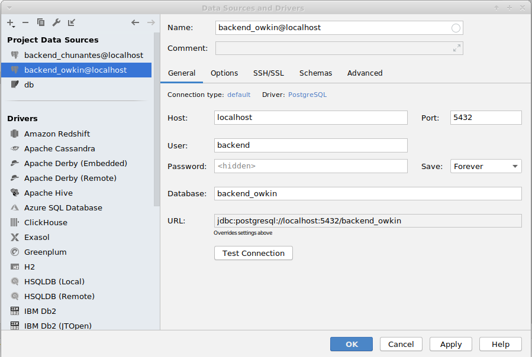
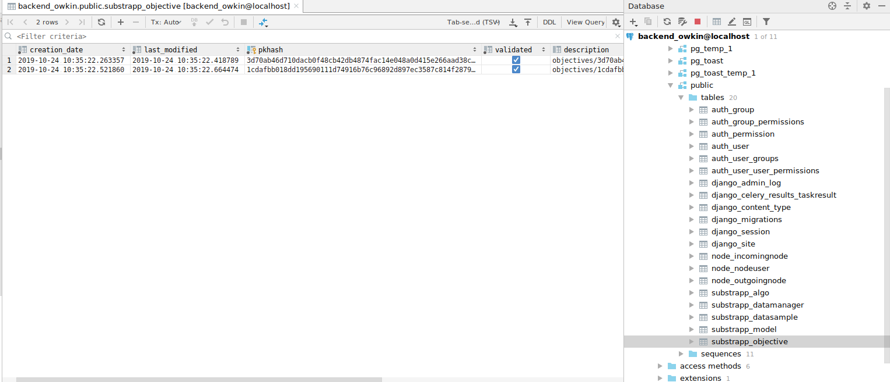

# Substrabac
Backend of the Substra platform

## Getting started 1: Prepare the django app

1. Clone the repo:
 ```
 git clone https://github.com/SubstraFoundation/substrabac
 ```
2. :warning: Do this step only if your environment development is on linux.
On linux systems, all the docker isntances create files with `root` permissions.
For working correctly in a dev environment, we need the files created by our dockers have the same rights as the one we use to launch our celery tasks.
The celery tasks run dockers containers, these containers create files (models), the celery tasks manipulate these files.

For being able to make dockers instance create files qith the rights as the current linux user, we need to modify some files as described here:
https://www.jujens.eu/posts/en/2017/Jul/02/docker-userns-remap/

:warning: Modifying these files will override your global system configuration. Keep in mind it will apply to all the launched dockers from your machine.
Open/Create file `/etc/docker/daemon.json` with:
```
{
  "userns-remap": "USER"
}
```
Replace `USER` by your username (`echo $USER`). It is the user who will launch the celery tasks.

Then run this command for knowing the docker group:
```bash
$> getent group docker
docker:x:999:guillaume
```

`999` in my case.

Now modify the file `/etc/subuid` like:
```bash
guillaume:1000:1
guillaume:165536:65536
```
The first line should be added with the `1000` group (here the user is guillaume, replace it by yours).

And the file `/etc/subgid`:
```bash
guillaume:999:1
guillaume:165536:65536
```
The first line should be added with the docker group (999 in my case).

Final step is to redownload all the dockers image, go in the substra-network project and rerun the `./bootstrap.sh` script.
Do not forget to build the substra-model image as described in the step 9 of this tutorial.

3. Install dependencies (might be useful to create a virtual environment before, eg using virtualenv and virtualenvwrapper):
  - For numpy, scipy, and pandas (for Unbuntu & Debian users): `sudo apt-get install python-numpy python-scipy python-pandas`
  - `pip install -r requirements.txt`
4. Setup the database:
  - Install [PostgreSQL](https://www.postgresql.org/download/) if needed
  - [Create a database](https://www.postgresql.org/docs/10/static/tutorial-createdb.html).
5. Create a main postgresql use with password:
  ```shell
  $> sudo su postgres
  $> psql
  $ CREATE USER substrabac WITH PASSWORD 'substrabac' CREATEDB CREATEROLE SUPERUSER;
  ```
6. Create two databases for both orgs: owkin and chu-nantes. A shell script is available, do not hesitate to run it.
It will drop the databases if they are already created, then create them and grant all privileges to your main user substrabac.
 (If this is the first time you create the databases, you will see some warnings which are pointless):

  ```shell
  $> ./substrabac/scripts/recreate_db.sh
```
7. We will populate data:

###### Clean environment (recommanded)

- With django migrations
```shell
python substrabac/manage.py migrate --settings=substrabac.settings.dev.owkin
python substrabac/manage.py migrate --settings=substrabac.settings.dev.chunantes```
```

###### With fixtures (fixtures container has been run from substra-network, old behavior for testing)

data in fixtures are relative to the data already set in the ledger if the fixtures container instance succeeded

Two solutions:
- With django migrations + load data
```shell
python substrabac/manage.py migrate --settings=substrabac.settings.dev.owkin
python substrabac/manage.py migrate --settings=substrabac.settings.dev.chunantes
python substrabac/manage.py loaddata ./fixtures/data_owkin.json --settings=substrabac.settings.dev.owkin
python substrabac/manage.py loaddata ./fixtures/data_chu-nantes.json --settings=substrabac.settings.dev.chunantes
```
- From dumps:
```shell
  $> ./substrabac/scripts/populate_db.sh
```
If you don't want to replicate the data in the ledger, simply run the django migrations.

Populate media files
```shell
  $> ./substrabac/scripts/load_fixtures.sh
```
It will clean the `medias` folders and create the `owkin` and `chu-nantes` folders in the `medias` folder.


8. Optional: Create a superuser in your databases:
```
python substrabac/manage.py createsuperuser --settings=substrabac.settings.dev.owkin
python substrabac/manage.py createsuperuser --settings=substrabac.settings.dev.chunantes
```

9. Build the substra-model docker image:
Clone the following git repo https://github.com/SubstraFoundation/substratools and build the docker image
```
docker build -t substra-model .
```

## Getting started 2: Linking the app with Hyperledger Fabric

### Get Fabric binaries

Run `./boostrap.sh`

### Make the subtra-network available to the app

[See here](https://github.com/SubstraFoundation/substra-network#network).

### Install rabbitmq

```shell
sudo apt-get install rabbitmq-server
```

### Launch celery workers

Execute this command in the `substrabac/substrabac` folder.

Note the use of the development settings.

```shell
DJANGO_SETTINGS_MODULE=substrabac.settings.dev.owkin celery -E -A substrabac worker -l info -B -n owkin -Q owkin,celery
DJANGO_SETTINGS_MODULE=substrabac.settings.dev.chunantes celery -E -A substrabac worker -l info -B -n chunantes -W chu-nantes,celery
```

 Note that you should run them NOT at the same time as we do not set different host and port right now.
 These celery workers have periodic task with a 10 sec period.

## Launch the servers

Go in the `substrabac` folder and run the server locally:
 ```
 python manage.py runserver 8000 --settings=substrabac.settings.dev.owkin
 python manage.py runserver 8001 --settings=substrabac.settings.dev.chunantes
 ```


## Test with unit and functionnal tests

```
    coverage run manage.py test
    coverage report    # For shell report
    coverage html      # For HTML report
```


## Test by creating a traintuple

###### Clean environment

Run the `populate.py` script which will create data in the ledger with a traintuple.
Check the status of the created traintuple `http://localhost:8000/traintuple/`
If everything run correctly, its status should pas from `todo->train->trained->testing->tested->done`.

When you want to re-run the testing process:
- Close every connections to the databases.
- Stop all your services and containers.
- Rerun `recreate_db.sh` and `clean_media.sh` scripts.
- Run the django migrations.
- Relaunch your substra-network.
- Run the owkin and chunantes substrabac servers.
- Run celery beat and celery owkin and chu-nantes.
- Run the `populate.py` python script.

###### With fixtures

You can test your environment by creating a traintuple:
```shell
curl -H "Accept: text/html;version=0.0, */*;version=0.0" -H "Content-Type: application/json" -d '{"algo_key":"6dcbfcf29146acd19c6a2997b2e81d0cd4e88072eea9c90bbac33f0e8573993f","model_key":"","train_data_keys":["62fb3263208d62c7235a046ee1d80e25512fe782254b730a9e566276b8c0ef3a","42303efa663015e729159833a12ffb510ff92a6e386b8152f90f6fb14ddc94c9"]}' -X POST http://localhost:8001/traintuple/?format=json
```
It will try to create a traintuple with creator: chu-nantes (localhost:8001).
The chu-nantes celery worker will try to add the traintuple to the ledger.
You can check your traintuple has been corectly added by visiting `http://localhost:8000/traintuple/` or `http://localhost:8001/traintuple/`
As the trainData passed are also created by chu-nantes, the chu-nantes celery worker will try to update the traintuple status to `training` and save some data if needed.
You can check `http://localhost:8000/traintuple/` or `http://localhost:8001/traintuple/` to check if the status of your newly created traintuple is set to `training` after 10 sec (celery worker periodic task period).
You can also check a new challenge has been added in `medias/chu-nantes` with a `metrics.py` file but not `description.md` file.

## Testing with the browsable API

For displaying data in a web browser, you will have to override your headers, especially the Accept header for specifiying the version.
You can use the modheader extension available [here for Chrome](https://chrome.google.com/webstore/detail/modheader/idgpnmonknjnojddfkpgkljpfnnfcklj) and [here for Firefox](https://addons.mozilla.org/en-US/firefox/addon/modheader-firefox/):

You can then configure it like that:


Now you can reach `http://localhost:8000/` and `http://localhost:8001/` :tada:

## Version

You will note substrabac use a versioned REST API with the header protocol.
Current is `0.0`.

## Miscelaneous

If you are using pycharm, you can very easily automate your servers and celery workers run configuration.

:warning: You have to specify the sources root of your django project:


Enable Django support:


Use these configurations for easier debugging and productivity:


Do not hesitate to put breakpoints in your code. Even with periodic celery tasks and hit the `bug` button for launching your pre configurations.

You can even access directly to the databases (password is `substrabac` as described in the beginning of this document):



## License

This project is developed under the Apache License, Version 2.0 (Apache-2.0), located in the [LICENSE](./LICENSE) file.

